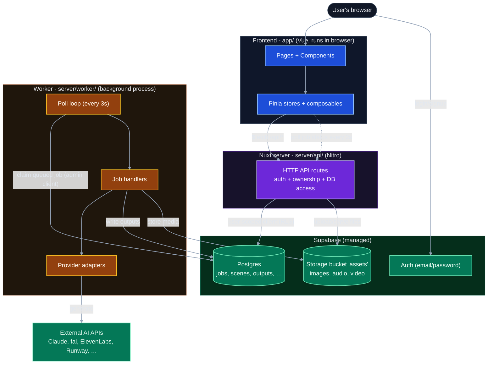

# Diagrams

Three views of the system, in increasing detail. Read the **overview** first to get the shape, the **detailed** one when you need to know which module talks to which, and the **user flow** to see the product from the user's side.

> These are [Mermaid](https://mermaid.js.org/) diagrams. They render as flowcharts in the Nuxt Content site; in a plain Markdown viewer you'll see the code. Before editing them, read the [diagram documentation guide](/guides/diagrams).

---

## 1. Overview - how the pieces fit

The three processes never call each other directly. The **database is the only channel**: the browser and worker both talk to Postgres, and coordinate through the `jobs` table.

**The core loop:** a component submits a job (`POST /api/jobs` → row inserted `queued`), then polls `GET /api/jobs/:id` every 2 s. Meanwhile the worker claims the job, runs a handler, calls an AI provider, writes results to `job_outputs` + Storage, and marks it `completed`. The next poll sees the result and the UI updates reactively.

See [architecture.md](/overview/architecture) for the narrative version.

---

## 2. Detailed - modules and data paths

Same system, expanded to the module level: which stores/composables drive which API routes, which handlers use which provider categories, and where each result lands. Follow the numbered pipeline order (script → export) down the middle.

```mermaid
flowchart TB
    %% ---------- FRONTEND ----------
    subgraph FE["Frontend  (app/)<br/><br/>"]
        direction TB
        WSPage["workspace/[projectId].vue<br/>tabs + stage orchestration"]
        subgraph Stages["stage components<br/><br/>"]
            ScriptC["ScriptStage / ScriptEditor"]
            SceneC["SceneSplitStage + SceneCard"]
            ImageC["ImageStage + ImageSceneCard"]
            AudioC["AudioStage + AudioPlayer"]
            VideoC["VideoStage + VideoSceneCard"]
            ExportC["ExportStage"]
        end
        subgraph FEState["stores + composables<br/><br/>"]
            SProject["useProjectStore"]
            SJobs["useJobsStore"]
            SWork["useWorkspaceStore"]
            CPoller["useJobPoller"]
            CScenes["useScenes"]
            CStages["useImage/Video/AudioStage"]
        end
        WSPage --> Stages
        Stages --> FEState
    end

    %% ---------- API ----------
    subgraph APIL["API routes  (server/api/)<br/><br/>"]
        direction TB
        AJobs["/api/jobs  (create+dedup, list, get+outputs)"]
        AProj["/api/projects (+ /settings)"]
        AScenes["/api/scenes (+ reorder)"]
        AAssets["/api/images · /videos · /audio<br/>/image-prompts · /video-prompts · /script"]
        ACombine["/api/audio/combine  (ffmpeg)"]
        AUpload["/api/uploads/media  (ffmpeg transcode)"]
        AKeys["/api/provider/keys (encrypt)"]
        ASettings["/api/settings · /api/exports"]
    end

    %% ---------- WORKER ----------
    subgraph WK["Worker  (server/worker/)<br/><br/>"]
        direction TB
        WLoop["loop.ts<br/>claim + retry (≤3)"]
        subgraph WHandlers["handlers/<br/><br/>"]
            H1["script"]
            H2["scene_split"]
            H3["image_prompt / video_prompt"]
            H4["image / video"]
            H5["audio"]
            H6["export  (ffmpeg assemble)"]
        end
        subgraph WLib["lib/<br/><br/>"]
            LJobs["jobs.ts<br/>storeText/FileOutput"]
            LKey["getProviderKey<br/>(decrypt)"]
            LAdmin["adminSupabase"]
        end
        subgraph WProv["providers/<br/><br/>"]
            PReg["registry + catalog"]
            PScript["script/*"]
            PImage["image/*"]
            PAudio["audio/*"]
            PVideo["video/*"]
        end
        WLoop --> WHandlers
        WHandlers --> WLib
        WHandlers --> PReg
        PReg --> PScript & PImage & PAudio & PVideo
    end

    %% ---------- SHARED / DATA ----------
    subgraph SH["shared/ + server/utils/<br/><br/>"]
        VF["videoFormat.ts (9:16, 180s)"]
        SL["scriptLength.ts (130 wpm)"]
        Crypto["crypto.ts (AES-256-GCM)"]
        FFmpeg["ffmpeg.ts"]
    end

    subgraph DATA["Supabase<br/><br/>"]
        direction TB
        TJobs[("jobs")]
        TOut[("job_outputs")]
        TScenes[("scenes")]
        TProj[("projects / project_settings")]
        TKeys[("api_keys / user_settings")]
        TExp[("exports")]
        Bucket[("Storage: assets/")]
    end

    ExtAI["External AI provider APIs"]

    %% ---- frontend to api ----
    CPoller -->|"POST/GET jobs"| AJobs
    SJobs -->|"bulk jobs"| AJobs
    SProject --> AProj
    CScenes --> AScenes
    CStages --> AAssets
    AudioC --> ACombine
    ImageC & VideoC & AudioC -->|"user uploads"| AUpload
    WSPage --> AKeys & ASettings

    %% ---- api to db ----
    AJobs --> TJobs
    AProj --> TProj
    AScenes --> TScenes
    AAssets --> TOut
    AKeys --> TKeys
    AKeys -. uses .-> Crypto
    ACombine & AUpload -. uses .-> FFmpeg
    ACombine & AUpload --> TOut
    AUpload --> Bucket
    ASettings --> TExp

    %% ---- worker to db ----
    WLoop -->|"admin client"| TJobs
    LAdmin --> TJobs & TScenes & TOut
    LJobs --> TOut
    LJobs --> Bucket
    H2 --> TScenes
    LKey -. reads .-> TKeys
    LKey -. uses .-> Crypto
    H6 -. uses .-> FFmpeg
    H6 --> TExp

    %% ---- worker to external ----
    PScript & PImage & PAudio & PVideo --> ExtAI

    %% ---- shared usage ----
    H1 -. uses .-> SL & VF
    ScriptC -. uses .-> SL & VF

    classDef default fill:#111827,stroke:#475569,stroke-width:1px,color:#e5e7eb
    classDef fe fill:#1d4ed8,stroke:#93c5fd,stroke-width:1.5px,color:#eff6ff
    classDef api fill:#6d28d9,stroke:#c4b5fd,stroke-width:1.5px,color:#faf5ff
    classDef wk fill:#92400e,stroke:#fbbf24,stroke-width:1.5px,color:#fff7ed
    classDef data fill:#047857,stroke:#6ee7b7,stroke-width:1.5px,color:#ecfdf5
    classDef util fill:#4d7c0f,stroke:#bef264,stroke-width:1.5px,color:#f7fee7
    style FE fill:#0f172a,stroke:#334155,stroke-width:1px,color:#e5e7eb
    style Stages fill:#111827,stroke:#1e40af,stroke-width:1px,color:#e5e7eb
    style FEState fill:#111827,stroke:#1e40af,stroke-width:1px,color:#e5e7eb
    style APIL fill:#17122b,stroke:#4c1d95,stroke-width:1px,color:#e5e7eb
    style WK fill:#1f160c,stroke:#78350f,stroke-width:1px,color:#e5e7eb
    style WHandlers fill:#1c1917,stroke:#92400e,stroke-width:1px,color:#e5e7eb
    style WLib fill:#1c1917,stroke:#92400e,stroke-width:1px,color:#e5e7eb
    style WProv fill:#1c1917,stroke:#92400e,stroke-width:1px,color:#e5e7eb
    style SH fill:#1a2e05,stroke:#4d7c0f,stroke-width:1px,color:#e5e7eb
    style DATA fill:#052e1b,stroke:#065f46,stroke-width:1px,color:#e5e7eb
    linkStyle default stroke:#94a3b8,stroke-width:1.5px,color:#e2e8f0
    class WSPage,ScriptC,SceneC,ImageC,AudioC,VideoC,ExportC,SProject,SJobs,SWork,CPoller,CScenes,CStages fe
    class AJobs,AProj,AScenes,AAssets,ACombine,AUpload,AKeys,ASettings api
    class WLoop,H1,H2,H3,H4,H5,H6,LJobs,LKey,LAdmin,PReg,PScript,PImage,PAudio,PVideo wk
    class TJobs,TOut,TScenes,TProj,TKeys,TExp,Bucket,ExtAI data
    class VF,SL,Crypto,FFmpeg util
```

Cross-references: [job-handlers.md](/backend/job-handlers) · [providers.md](/backend/providers) · [api-routes.md](/backend/api-routes) · [schema.md](/database/schema).

---

## 3. User flow - the product from the outside

What a person actually does, and the pipeline stage each step advances (`projects.current_stage`). Tabs unlock left-to-right; regeneration and going back are always allowed.

```mermaid
flowchart TD
    Start(["Visit site"]) --> Auth{"Signed in?"}
    Auth -->|No| Signup["Sign up / Log in<br/>(Supabase email auth)"]
    Signup --> Dash
    Auth -->|Yes| Dash["Dashboard - project list"]

    Dash --> New["Create project"]
    New --> WS["Open workspace"]
    Dash -->|"open existing"| WS

    WS --> Key{"Provider API<br/>key saved?"}
    Key -->|No| PasteKey["Paste key in model selector<br/>(stored encrypted)"]
    PasteKey --> ScriptTab
    Key -->|Yes| ScriptTab

    subgraph Pipeline["Editing pipeline (tabs)<br/><br/>"]
        direction TB
        ScriptTab["SCRIPT tab<br/>enter idea + tone + length"] --> Gen3["Generate 3 script options"]
        Gen3 --> Pick["Pick one · edit · refine"]
        Pick --> Split["Split into scenes<br/>→ stage: scene_split"]
        Split --> EditScenes["Tweak scene text / order / add / delete"]

        EditScenes --> ImgTab["IMAGE tab<br/>→ stage: image"]
        ImgTab --> ImgPrompts["Generate image prompts"]
        ImgPrompts --> ImgGen["Generate / upload image per scene"]

        ImgGen --> AudTab["AUDIO tab<br/>→ stage: audio"]
        AudTab --> Voice["Choose voice + settings"]
        Voice --> AudGen["Generate voiceover per scene<br/>→ combine into one track"]

        AudGen --> VidTab["VIDEO tab<br/>→ stage: video"]
        VidTab --> SkipQ{"Skip Video Gen?"}
        SkipQ -->|"On"| Slideshow["Use scene images as slideshow"]
        SkipQ -->|"Off"| VidPrompts["Generate motion prompts"]
        VidPrompts --> VidGen["Generate / upload clip per scene<br/>(image-to-video)"]
    end

    Slideshow --> ExportStage
    VidGen --> ExportStage["EXPORT<br/>→ stage: export"]
    ExportStage --> Export["Export MP4<br/>(ffmpeg assembles everything)"]
    Export --> Download(["Download video + manifest"])

    classDef default fill:#111827,stroke:#475569,stroke-width:1px,color:#e5e7eb
    classDef entry fill:#1d4ed8,stroke:#93c5fd,stroke-width:1.5px,color:#eff6ff
    classDef action fill:#6d28d9,stroke:#c4b5fd,stroke-width:1.5px,color:#faf5ff
    classDef decision fill:#92400e,stroke:#fbbf24,stroke-width:1.5px,color:#fff7ed
    classDef done fill:#047857,stroke:#6ee7b7,stroke-width:1.5px,color:#ecfdf5
    style Pipeline fill:#0f172a,stroke:#334155,stroke-width:1px,color:#e5e7eb
    linkStyle default stroke:#94a3b8,stroke-width:1.5px,color:#e2e8f0
    class Start,Dash,Download entry
    class Signup,New,WS,PasteKey,ScriptTab,Gen3,Pick,Split,EditScenes,ImgTab,ImgPrompts,ImgGen,AudTab,Voice,AudGen,VidTab,VidPrompts,VidGen,Slideshow,ExportStage,Export action
    class Auth,Key,SkipQ decision
```

For the file-level trace of one of these steps, see [data-flow-walkthrough.md](/overview/data-flow-walkthrough); for the stages and tab-gating, see [pages-and-routing.md](/frontend/pages-and-routing).
