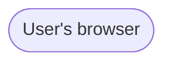
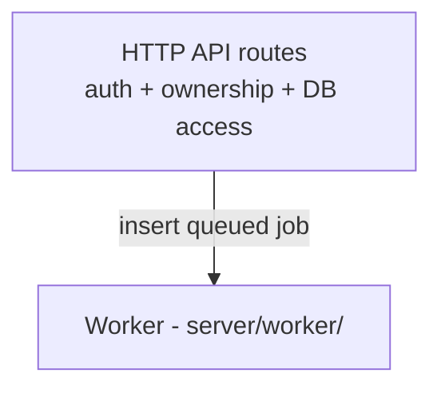
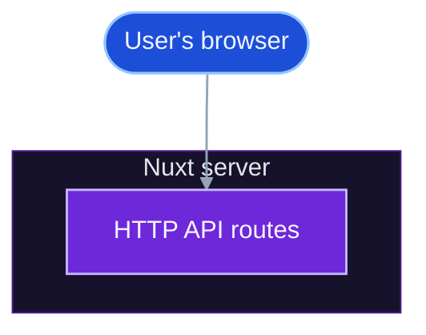

Use this guide before editing `/overview/diagrams`, whose source file is `docs-site/content/1.overview/2.diagrams.md`.

## When diagrams need updates

Check the diagrams after changes that affect:

- System boundaries between browser, Nuxt server, worker, Supabase, storage, or external AI providers.
- Job queue behavior, polling, handler flow, retries, or output writes.
- User-facing pipeline order or stage gating.
- Major module names, provider categories, or data paths shown in a diagram.

Do not update diagrams for small implementation details that do not change the shape of the system.

## Mermaid rules

The docs site renders fenced `mermaid` blocks through Nuxt Content.

````md

````

Keep diagrams parseable and stable:

- Quote labels when they contain `/`, `(`, `)`, `:`, commas, apostrophes, arrows, or HTML.
- Keep node IDs stable when only the label changes.
- Prefer descriptive node IDs such as `NuxtServer`, `JobHandlers`, and `Supabase`.
- Do not put YAML frontmatter-style config blocks inside Mermaid fences; this renderer can display them as stray diagram text.
- Preserve the existing diagram intent; do not combine unrelated diagrams into one dense map.
- Keep arrows directional and label only the edges where the relationship is not obvious.
- Keep edge labels short so label backgrounds do not crowd nearby paths.
- Do not use em dashes. Use a colon, comma, parentheses, or a spaced hyphen instead.
- Use `classDef` colors that remain readable in both light and dark mode.
- Use a consistent visual language: blue for browser/frontend, purple for API/server actions, amber for worker/decision nodes, green for data/completed states, and lime for shared utilities.
- Use `style` on subgraphs to give major sections subtle dark backgrounds and borders.
- Use `linkStyle default` to keep connector strokes and edge-label text readable.

## Label examples

Good:



Avoid:

````md
```mermaid
flowchart TD
    API[HTTP API routes (auth + DB)]
    Worker[Worker: server/worker/]
```
````

Unquoted special characters are the most common Mermaid parsing failure.

## Styling example

Keep styling reusable and grouped near the end of the diagram:



Do not change the palette just to make one diagram decorative. Add a new class only when the diagram introduces a genuinely new kind of node.

## Editing workflow

1. Read the current `/overview/diagrams` page through MCP or source.
2. Decide which diagram changed: overview, detailed modules, user flow, or multiple.
3. Make the smallest diagram update that reflects the code or product change.
4. Keep the explanatory paragraph below the diagram in sync.
5. Run docs validation.

## Validation

Run the fast preflight as the normal validation step:

```bash
cd docs-site
npm run check
```

Run the full docs build only occasionally: for larger docs-site changes, Mermaid rendering investigations, or when you specifically need full static validation.

```bash
cd docs-site
npm run generate
```

For visual changes, start the docs server and inspect `/overview/diagrams`:

```bash
cd docs-site
npm run dev
```

Check that all Mermaid diagrams render as SVGs, labels are legible in light and dark mode, and the page still reads naturally in a plain Markdown viewer.
